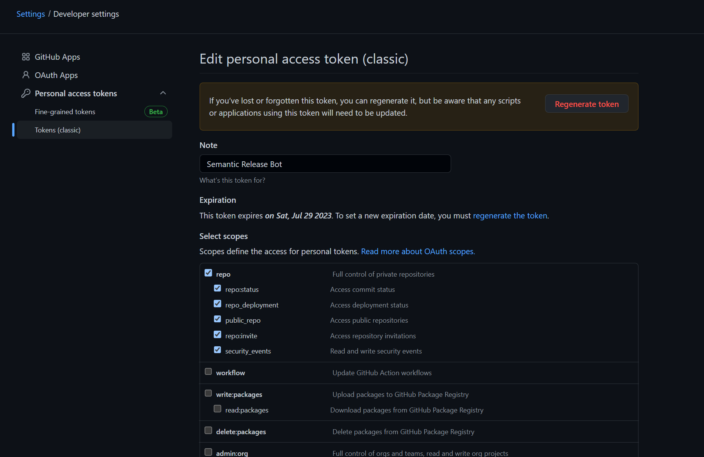

## Create Unity Package
This tool automates the process of creating a `Unity Package` compatible with `Package Manager`. Complete the form and the tool will create the new unity project, folders, and Assembly for you.

[](https://www.youtube.com/watch?v=nq8NikmkU2o)

## Installation

Just type `npx create-unity-package`, npm auto install all dependencies for you.

## Template structure

```
Assets/
├── Package -------------------------- Package content
│   ├── Editor ----------------------- Editor only
│   ├── Tests ------------------------ Editor only + Unit Tests
│   └── Runtime ---------------------- MultiPlatform assets, 
│       └── Samples ------------------ Samples is renamed to ~Samples in CI
│           ├── SampleA
│           └── SampleB
├── Scripts -------------------------- Stagging files
├── Sprites -------------------------- Stagging files
└── Models --------------------------- Stagging files
```

## CI

When CI is enabled, `Package` folder inside `Assets` will be deployed to branch `upm`.

You can install deployed package in `Unity Package Manager` using:

`https://github.com/USER_NAME/REPO.git#upm`

> Change `USER_NAME` and `REPO` to you git 

Generated project uses semantic-release to auto create tags, releases and change log, therefore, you also can specifiy version code:

`https://github.com/USER_NAME/REPO.git#VERSION`

> Change `VERSION` to `1.0.0` or other release from you repo.

See [semantic-release](https://github.com/semantic-release/semantic-release) for more details.

### GITHUB_TOKEN 

CI's needs GitHub token to create releases and tags in your name.

Go to Personal Tokens https://github.com/settings/tokens and create new Classic Token with this permissions:



Before, paste token content in github secrets with name `GITHUB_TOKEN`

## Projects using this

- [hgs-unity-call-limiter](https://github.com/homy-game-studio/hgs-unity-call-limiter).
- [hgs-unity-local-storage](https://github.com/homy-game-studio/hgs-unity-local-storage).
- [hgs-unity-tone](https://github.com/homy-game-studio/hgs-unity-tone).
